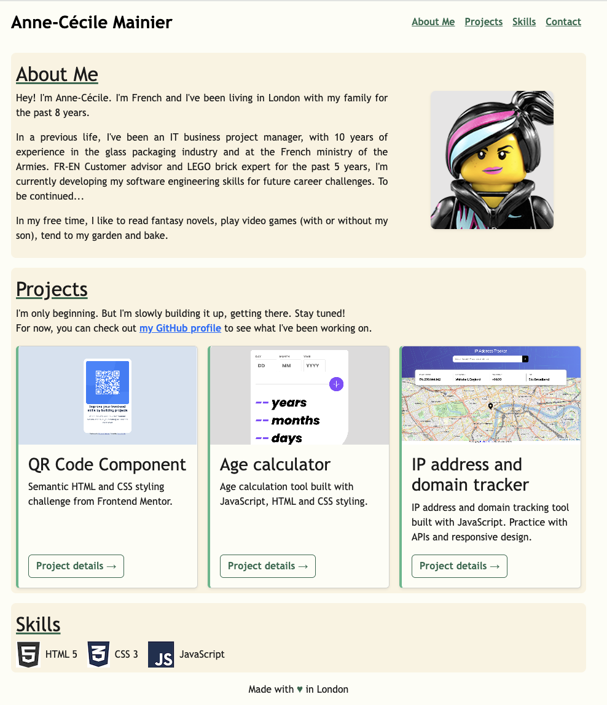

# Portfolio Project

This is a refactored version of my portfolio website, as a submission to the challenge Week 3 of the skills Bootcamp in Full Stack Web Development, organized by Step8Up Ltd.

## Overview

### Screenshot

### Link

- Repository: [https://github.com/acmainier/portfolio-bootstrap](https://github.com/acmainier/portfolio-bootstrap)
- Webpage: [https://acmainier.github.io/portfolio-bootstrap/](https://acmainier.github.io/portfolio-bootstrap/)

## Built with

- Semantic HTML5 markup
- Bootstrap and CSS custom properties
- jQuery for the project details and date picker on contact form

## Author

- Github - [Anne-Cécile Mainier](https://github.com/acmainier)
